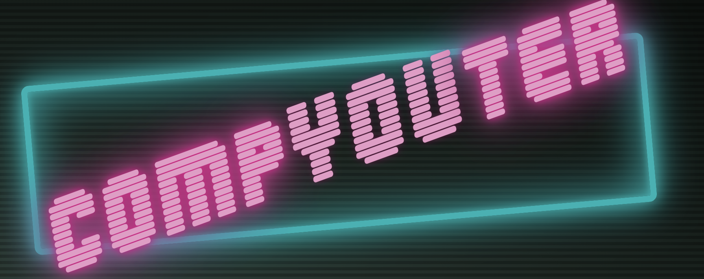

# [<p align='center'></p>][1]

Welcome to the compYOUter ReadMe!

CompYOUter is be a simple, interactive application exploring the field of human-computer interaction (HCI). Users can utilize their webcam to track their movements and apply filters over keypoints on their body. This project was built by [Marco Torre][2] using:

* Javascript
* [Tensorflow][8]
* [PoseNet][7]
* CSS/SASS
* Node.js
* Canvas
* Inspired by the work of [Charlie Gerard][9]


## <p align="center"> [Check Out the Live App!][1] </p>

## Setting up Video Stream

The first step was prompting the user for access to their webcam. To accomplished this I took advantage of vanilla DOM manipulation to grab the video element with `document.getElementById()` along with the MediaDevices WebAPI and `getUserMedia()` to request video access from the user and generate a video stream object. I then created and returned new Promises from the `setupVideo()` function so that I could later use it in conjunction with Javascript's `async` & `await` functions so the code for the video filters doesn't fire until the video stream is set up.

```js
// Grabbing with video element with vanilla DOM manipulation and then using MediaDevices WebAPI to prompt the user for camera access
var video = document.getElementById("video");
const stream = await navigator.mediaDevices.getUserMedia({
   audio: false,
   video: {
      height: 560, 
      width: 700,
      facingMode: "user",
   },
});
```

```js
// Generating a custom Promise object to use in conjunction with async & await so the code for the video filters doesn't fire until the video stream is set up.
    return new Promise((resolve) => {
        video.onloadedmetadata = () => { 
            resolve(video);
    }})
```

## Setting up PoseNet

[Tensorflow][8] - a popular machine learning library for Javascript - and [PoseNet][7] - one of their machine learning models - provided an accessible way to track a user's movement through the web feed I'd set up. To achieve this, I utilized PoseNet's inbuilt functions in conjunction with Javscript's asynchronicity (using `async` and `await` for DRYer, cleaner code) to grab each video frame and generate a single pose estimation with associated keypoints.

```js
const detectPoseInRealTime = async (video) => {
    async function poseDetectionFrame() {
        net = await posenet.load({
            architecture: "MobileNetV1",
            outputStride: 16,
            inputResolution: 516,
            multiplier: 0.75,
        });
//Using PoseNet's native functionality to grab the keypoint information for a single video grame
        pose = await net.estimateSinglePose(
            videoElement,
            scaleFactor,
            flipHorizontal,
            outputStride
        );

        animationReq = requestAnimationFrame(poseDetectionFrame);
    }
    poseDetectionFrame();
}
```

## Drawing over Webcam Feed with KeyPoints & Canvas

The last step was figuring out a way to overlay images or drawings on top of the video feed. I pulled keypoints from the PoseNet keypoints object and filtered them by confidence rating and then established them as context on which to draw using Canvas.

```js
// Drawing the circle for the 'compmoji' button by grabbing a specific keypoint from the PoseNet Pose object and filtering based on the minimum confidence score
function drawHead(keypoints, minConfidence, ctx, scale = 1) {
    const keypoint = keypoints[0];
    if (keypoint.score >= minConfidence) {
        const { y, x } = keypoint.position;
        drawPoint(ctx, y * scale, x * scale, 100, '#E699C8');
    }
}
```

```js
//creating the function that, on activating one of the rocker switches, sets up Posenet (and, in turn, the video stream), draws the specific filter over each frame, and then clears the everything one the switch it deactivated
compButton.addEventListener('change', async () => {

        if (!compButton.checked) {
            robotButton.setAttribute("disabled", true);
            await setupPoseNet()
            drawFunc = setInterval(async () => {
                if (pose) {
                    ctx.clearRect(0, 0, width, height);
                    drawFace(poseKeypoints, 0.8, ctx, 1);
                }
            }, 1)
        } else if (compButton.checked) {
            ctx.clearRect(0, 0, width, height);
            ctx.fillStyle = 'black'
            ctx.fillRect(0, 0, width, height);
            endStream(video)
            removePoseNet()
            clearInterval(drawFunc)
            disposeVariables()
            compButton.removeEventListener('change', () => { })
            robotButton.removeAttribute("disabled");
        }
    })
```

# Creator 

##  
## **Marco Torre** 
[][3] 
[][4] 
[][5] 
[][6]

Marco is originally from New Orleans and studied performing arts at NYU and later got his masters from conservatory in London. His passion for creating exciting and engaging things inspired him to become a software engineer. He loves taking a creative approach to problem solving and writing clean, concise code to build applications that inspire and intrigue.

[1]: https://www.marcotorre.io/compYOUter
[2]: https://www.marcotorre.io/#

[3]: https://www.linkedin.com/in/marco-torre-388286138/
[4]: https://github.com/OcramT
[5]: https://angel.co/u/marco-torre-1
[6]: https://www.marcotorre.io/

[7]: https://blog.tensorflow.org/2018/05/real-time-human-pose-estimation-in.html
[8]: https://www.tensorflow.org/js/
[9]: https://charliegerard.dev/